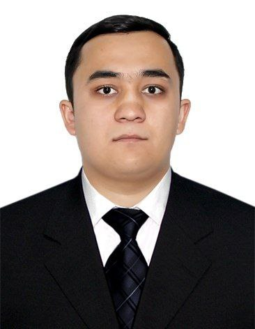

# Ogabek Otakhonov

**Frontend Developer**  
Tashkent, Uzbekistan  
**Email:** otaxonovo22222@gmail.com | **Phone:** +998941259977  
**GitHub:** https://github.com/ogabek542  
**LinkedIn:** (https://www.linkedin.com/in/ogabek-otaxonov-10b26025b/)  
**LeetCode:** https://leetcode.com/u/otaxonovo22222/
**HackerRank:** https://www.codewars.com/users/ogabek21
**Discord:** ogabek0218



---

## About Me

Result-driven Frontend Developer focused on building clean, performant, and accessible web apps. I enjoy turning complex business logic into simple UI/UX. Comfortable with React/Next.js, REST APIs, state management, and data-driven dashboards (Chart.js/Recharts). I value teamwork, code quality, and continuous learning.

**Goals & Priorities:** deepen expertise in TypeScript/React ecosystem, deliver reliable enterprise UI, and grow into a full-stack/frontend lead role.

---

## Skills

- **Languages:** JavaScript, TypeScript, HTML, CSS, SQL
- **Frameworks/Libraries:** React.js, Next.js, Redux Toolkit, MUI, TailwindCSS, Shadcn, SASS, Bootstrap, Vite
- **Tools/Platforms:** Git, GitHub, VS Code, Postman, Figma
- **Data:** REST API integration, CRUD, SQL, MongoDB
- **Extras:** Chart.js, Recharts, performance & optimization, accessibility basics

---

## Code Example (from Codewars)

**Task:** Check if a string is an isogram (no repeating letters).

```js
// isIsogram — case-insensitive, letters only
function isIsogram(str) {
  const s = str.toLowerCase().replace(/[^a-z]/g, "");
  return new Set(s).size === s.length;
}
```
